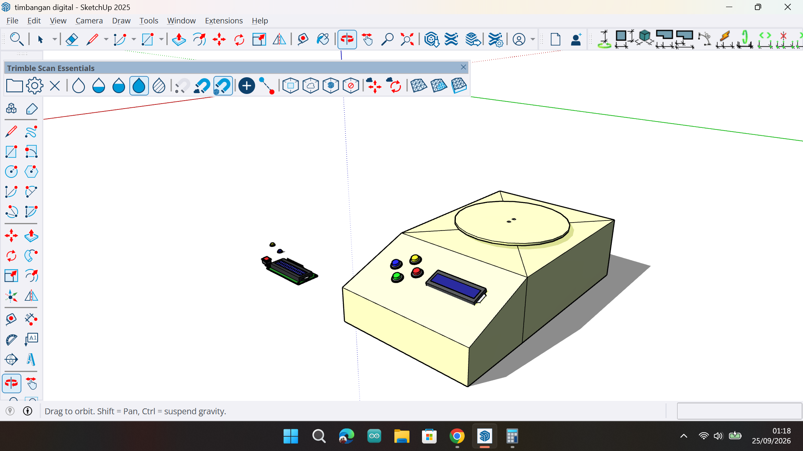

# OLED Text Animation Arduino

Proyek sederhana Arduino menggunakan OLED SSD1306 untuk menampilkan kata, lirik lagu atau kalimat secara bergantian dengan durasi yang berbeda pada setiap kata.

## Creator

**Muhammad Rifqi Naufal**
TikTok: Naufal's Lab

## Deskripsi

Program ini menampilkan serangkaian kata pada layar OLED 128x64 menggunakan modul SSD1306. Setiap kata memiliki waktu tampil yang berbeda sehingga dapat digunakan untuk membuat animasi teks, quotes, atau pesan berjalan sederhana.

## Hardware yang Digunakan

* Arduino Nano
* OLED SSD1306 128x64 I2C
* Kabel Jumper
* Breadboard

## Library

Library yang diperlukan:

* Adafruit GFX Library
* Adafruit SSD1306 Library
* Wire Library

## Wiring OLED I2C

| OLED | Arduino Nano |
| ---- | ----------- |
| VCC  | 5V          |
| GND  | GND         |
| SDA  | A4          |
| SCL  | A5          |

Untuk board lain, sesuaikan pin I2C yang digunakan.

## Cara Kerja

1. OLED diinisialisasi pada alamat I2C `0x3C`.
2. Array `kata[]` menyimpan daftar kata yang akan ditampilkan.
3. Array `delayKata[]` menyimpan durasi tampil masing-masing kata.
4. Program menampilkan kata satu per satu secara berurutan.
5. Setelah kata terakhir selesai ditampilkan, program mengulang dari awal.

## Screenshot

Tambahkan foto hasil proyek pada folder:

```text
images/
```

Lalu tampilkan di README:

.
.

## Source Code

File utama:

```text
OLED_Text_Animation.ino
```

## Hasil Tampilan

Sudah → Terbiasa → Terjadi → Tante → Teman → Datang → Ketika → Lagi → Butuh → Saja → Coba → Kalau → Lagi → Susah → Mereka → Semua → Menghilang..

## Lisensi

Silakan gunakan, modifikasi, dan pelajari proyek ini untuk kebutuhan pembelajaran maupun pengembangan pribadi.

## Follow

TikTok: Naufal's Lab

Terima kasih telah mencoba proyek ini.

# 🎵 Project: OLED Lyric Displayer

Proyek ini menggunakan layar **OLED SSD1306 dengan modul I2C** untuk menampilkan lirik lagu secara otomatis menggunakan Arduino.

## 📸 Hasil Pengujian
Berikut adalah dokumentasi tampilan layar OLED saat menjalankan program lirik lagu:


## 🛠️ Komponen yang Digunakan
* Arduino Uno / Nano
* Modul LCD OLED I2C SSD1306 (0.96 inch)
* Kabel Jumper
